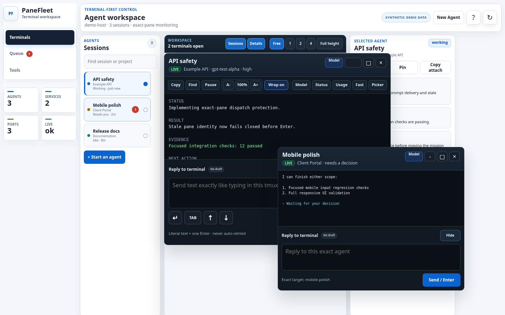
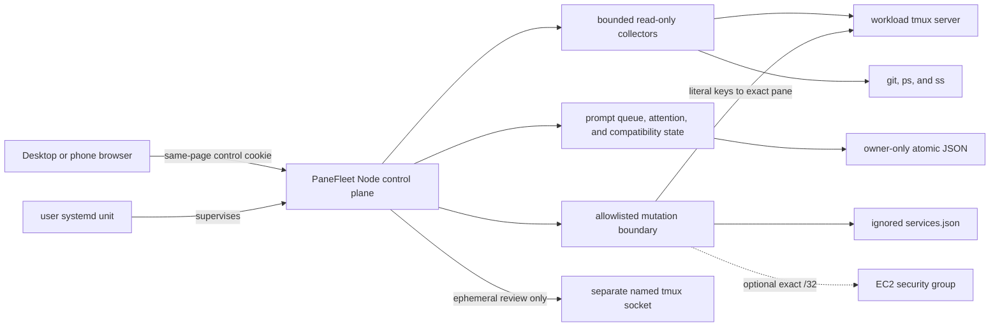

# PaneFleet

### A safety-first control room for tmux-based AI coding agents

Supervise long-running Codex sessions from desktop or phone, keep project context beside each terminal, line up prompts for the next green composer, and expose only explicitly allowlisted host controls.


<p align="center">
  
</p>

<p align="center"><sub>Actual browser render using synthetic sessions, projects, and terminal output. No live host data appears in this repository.</sub></p>

## Why PaneFleet exists

Running several coding agents in tmux works well until the operator has to remember which pane owns which task, which project has uncommitted work, which agent is waiting, and whether a pasted prompt was really submitted. The friction is worse from a phone.

PaneFleet keeps tmux as the durable runtime and adds the missing operator layer:

- movable, resizable, and tiled terminal previews;
- exact-pane targeting for terminal input;
- branch, changed-file, test, instruction, artifact, and note context for the focused project;
- a durable per-terminal prompt queue with optional UTC cron intake that releases only on stable green readiness;
- exception-focused attention and browser notifications; and
- narrowly allowlisted service, listener, process, and EC2 ingress tools.

It is deliberately not an autonomous agent framework. PaneFleet helps one human safely supervise the terminal agents they already run.

## What makes it different

| Concern | PaneFleet behavior |
| --- | --- |
| Terminal identity | Revalidates session creation time, pane coordinate, intrinsic tmux pane ID, and pane PID before sensitive input |
| Prompt delivery | Sends literal text plus one Enter, then observes acceptance; ambiguous delivery is never retried automatically |
| Queued prompts | Bind to one exact tmux pane, wait for two stable green samples, and release FIFO one prompt at a time |
| Recurring prompts | Parse five-field UTC cron in-process and add at most one normal queue item per schedule when due, or queue one occurrence manually with **Queue now**; never execute cron as shell |
| Uncertain delivery | Pauses that terminal's line for inspection and never retries or advances automatically |
| Host actions | Uses named API operations and an ignored local registry; there is no arbitrary shell-command endpoint |
| Filesystem access | Restricts reads to reviewed roots with real-path containment, output caps, and sensitive-value redaction |
| Restarts | Keeps the systemd control plane outside the workload tmux server and compares pane inventory around restart |

## Product tour

### Terminal workspace

Open, tile, minimize, resize, and restore several tmux-backed terminals without replacing tmux itself. The session rail shows each live Codex agent and each registered or auto-discovered non-Codex tmux workload once; multi-window workloads are grouped into one read-only entry. Restored views must still match their original exact pane identity.

Terminal input remains intentionally plain: reviewed literal text followed by one Enter. Read tools never send input, while picker navigation, interrupt, stop, and recovery remain visibly separate operations. If Codex exits to its still-live shell after an update, the exact terminal presents **Restart Codex** instead of looking like an unusable composer. See [Features](docs/features.md#terminal-workspace) for the complete desktop, phone, and keyboard behavior.

### Project Desk and prompt scratchpad

Focusing a terminal loads bounded project context beside it:

- current branch and changed files;
- available checks and their recorded state;
- nearest project instructions;
- reviewed links and downloadable PDF, Markdown, and HTML outputs;
- browser-local project notes; and
- persistent prompt drafts and reusable snippets.

A scratchpad draft cannot reach tmux until the operator reviews both the text and the exact target terminal.

### Green-light prompt queue

Choose an exact live terminal, add a plain prompt, and keep working elsewhere. Blue means the agent is working, orange means it needs input, and green means the Codex composer is visibly ready. PaneFleet requires two stable green observations before it durably claims and submits the first prompt for that terminal.

Before typing, PaneFleet arms exit preservation on that exact pane and revalidates its intrinsic identity. If the guard cannot be applied, no text is sent. If Codex exits after Enter, the pane remains available for inspection, becomes stopped instead of green, and receives no automatic retry.

The Queue workspace shows each exact-pane FIFO line, current work, recurring schedules, and bounded delivery history. One reviewed prompt can be queued atomically for up to twelve agents; a stale target rejects the whole queue operation, while immediate multi-send reports each irreversible result separately. A user can leave only before dispatch claims an item.

PaneFleet monitors queues and due schedules on the server even when every browser is closed. It advances a delivered item only from exact-pane final evidence: a stable `Worked for` footer or a safely bounded footerless return to a later composer. Uncertain rendering, submission, identity, completion, or newer activity pauses for explicit review and is never retried automatically. A pre-Enter item can remain blocked in **Wait again — no resend** while PaneFleet watches for the operator to submit that already-visible prompt manually.

The same workspace keeps proposed ideas non-runnable until approval creates a normal exact-pane ticket. Optional five-field UTC schedules add ordinary queue items, coalesce while one occurrence remains open, and skip replaced targets without catch-up bursts.

See [Features](docs/features.md#green-light-prompt-queue) for queue states and recovery actions, and [Safety model](docs/safety-model.md#prompt-queue-invariants) for the enforced invariants.

### Phone-first terminal access

On a phone, the session list remains bounded and one terminal becomes a fullscreen control surface. A named chooser, previous/next navigation, durable drafts, and passively replayed session and per-ticket usage—kept separate from account-wide limits—make multi-agent operation practical without sending status commands.

<p align="center">
  
</p>

<p align="center"><sub>Synthetic mobile capture at 390 × 844.</sub></p>

### Host and access tools

PaneFleet can show tmux sessions, listeners, processes, registered services, recent audit events, and selected EC2 inbound rules. Mutations stay behind allowlisted server operations and explicit confirmation.

The Security view keeps a bounded, owner-only connection and SSH journal and flags new peers, unexpected public listeners, authentication failures, and uncommon outbound ports. Monitoring is read-only and retains parsed metadata rather than raw journal lines.

The optional IP workflow can authorize one globally routable IPv4 `/32` and preview cleanup of stale PaneFleet-owned rules. It preserves active SSH peers and unmanaged, IPv6, source-group, prefix-list, broad, unrelated-port, and otherwise out-of-scope rules.

## Safety model

PaneFleet is privileged, single-operator software. It assumes the host account, tmux server, Codex configuration, and service registry belong to one trusted operator.

Network access has two supported shapes:

1. **Recommended:** bind to loopback and connect through an SSH tunnel or private overlay.
2. **Explicit non-loopback:** use the built-in Basic challenge by default, or suppress it only in `trusted-network` mode after an external firewall or cloud security group has independently been verified to allow the dashboard port solely from the operator's exact IPv4 `/32`.

Every operational `/api` request still requires an HttpOnly, SameSite=Strict control cookie issued by the same page. POST requests additionally require JSON and same-origin validation. `/healthz` is the only intentionally minimal public route.

> [!WARNING]
> Do not expose PaneFleet broadly. It can observe terminal and host state and can send input to explicitly selected panes.

Read the full [Safety model](docs/safety-model.md) before using non-loopback access or enabling host mutations.

## Architecture



The browser is vanilla HTML, CSS, and JavaScript. The server uses Node.js built-ins plus small host-command adapters and has zero runtime npm dependencies.

Connected browsers share one server-owned SSE broadcast cycle. PaneFleet sends a complete sequenced snapshot on connection, then fans out the same top-level patch to every current client. A sequence gap reconnects for a complete snapshot, and a patch that would be larger falls back to the complete form. This reduces recurring transfer without weakening the exact-state revalidation performed by mutations.

See [Architecture](docs/architecture.md) for state ownership, request flow, and the exact-pane dispatch sequence.

## Quick start

### Requirements

- Linux and Node.js 20 or newer
- `tmux`, `git`, `curl`, `ps`, and `ss`
- Codex CLI installed and authenticated for agent launch and prompt controls
- a modern browser

AWS CLI and instance permissions are needed only for the optional EC2 access workflow. systemd is optional for foreground evaluation and recommended for persistent operation.

### Run safely on loopback

```bash
git clone https://github.com/OWNER/PaneFleet.git panefleet
cd panefleet
npm ci
cp services.example.json services.json
npm run verify:public
HOST=127.0.0.1 PORT=8787 npm start
```

Open `http://127.0.0.1:8787` on the host. From another machine, keep PaneFleet on loopback and create a tunnel:

```bash
ssh -N -L 8787:127.0.0.1:8787 user@your-host
```

Then open `http://127.0.0.1:8787` locally.

The ignored `services.json` file is optional and controls only reviewed service actions. Existing tmux sessions remain visible without it. Copy `host-config.example.json` to the ignored `host-config.json` when you need additional workspace roots, display aliases, groups, links, or artifact directories.

For systemd installation, authenticated non-loopback access, trusted-network mode, migration, backups, and restart behavior, read [Operations](docs/operations.md).

## Validation

```bash
npm run check
```

`npm run check` performs syntax validation, the complete coverage-gated suite, and the worktree-and-history privacy scan. `npm run verify:public` is the release-facing alias for that same complete gate. For iteration, `npm run test:core` runs runtime and safety regressions, while `npm run test:features` runs UI, configuration, documentation, and Project Desk coverage. The complete runner executes both groups even when core reports a failure, then returns a failing status after all regressions have been reported.

The test launcher owns an isolated temporary directory and skips candidates that are not writable, searchable directories or whose filesystems have less than 256 MiB available before fixtures start. Set `PANEFLEET_TEST_TMP_ROOT` only when a specific writable test volume is required.

The integration suite runs the real `server.js` entrypoint with fake tmux, AWS, metadata, Git, and host-process executables. It exercises production routing without touching live sessions or host controls.

`npm run test:coverage` measures every Node-executable runtime module, including the server, collectors, retention and scheduling helpers, shared sanitization, process runner, and executable UI-state helpers. It enforces the checked-in floor per file; browser and test-tool entrypoints have explicit test-strategy exclusions guarded by the source inventory. `npm run check` includes that gate.

The privacy checker scans modified tracked files, untracked non-ignored files, and every stored Git commit, tag, and blob—including unreachable objects retained by reflogs. Ignored runtime data remains local and outside the publication candidate set. The checker rejects machine-local configuration, credentials, personal paths, non-documentation network identifiers, and unreviewed binary captures.

## Reproducing the screenshots

The committed images are generated from [docs/readme-demo.html](docs/readme-demo.html), which contains only synthetic data and uses the real application stylesheet.

```bash
CHROME_BIN=/path/to/chrome npm run screenshots:readme
npm run privacy:check
```

Only the two reviewed README capture paths are permitted by the privacy checker; arbitrary screenshots remain blocked.

## Repository map

| Path | Purpose |
| --- | --- |
| `server.js` | HTTP control plane, collectors, coordination state, and guarded actions |
| `process-runner.js` | Central process adapter and permanently forbidden tmux operations |
| `public/` | Dependency-free terminal-first browser interface |
| `services.example.json` | Sanitized template for the ignored local service registry |
| `host-config.example.json` | Sanitized template for workspace and artifact configuration |
| `ops/` | User-systemd unit template |
| `scripts/` | Installation, restart, screenshot, access-token, and privacy helpers |
| `test/` | Isolated integration, lifecycle, prompt-queue, terminal, and UI tests |
| `docs/` | Features, architecture, configuration, safety, and operations references |

## Current limits

- PaneFleet is for one trusted operator on one Linux host, not multiple users or distributed workers.
- Agent-state inference is Codex-first and intentionally conservative.
- Terminal windows show bounded tmux captures; PaneFleet is not a full browser PTY emulator.
- Prompt queue and UTC cron schedule state is local durable JSON, not a distributed or database-backed scheduler.
- The EC2 ingress workflow is optional and environment-specific.
- A public live demo would grant control of its host, so this repository uses reproducible synthetic captures instead.

## Documentation

- [Features](docs/features.md)
- [Architecture](docs/architecture.md)
- [Configuration](docs/configuration.md)
- [Safety model](docs/safety-model.md)
- [Operations](docs/operations.md)
- [Security policy](SECURITY.md)
- [Contributing](CONTRIBUTING.md)

## License

PaneFleet is available under the [MIT License](LICENSE). The `private: true` field in `package.json` prevents accidental npm publication; it does not change the source license.
